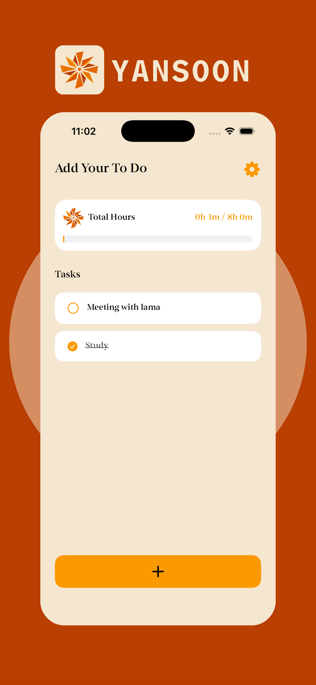
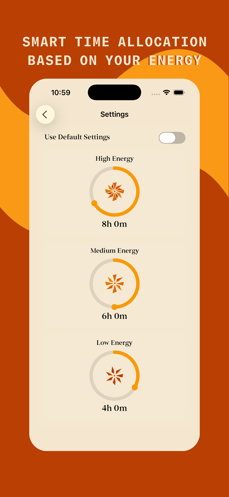
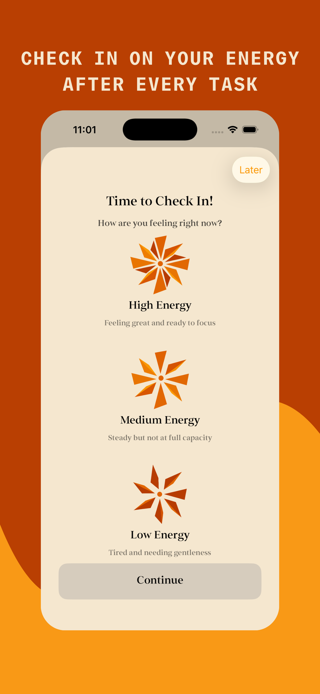
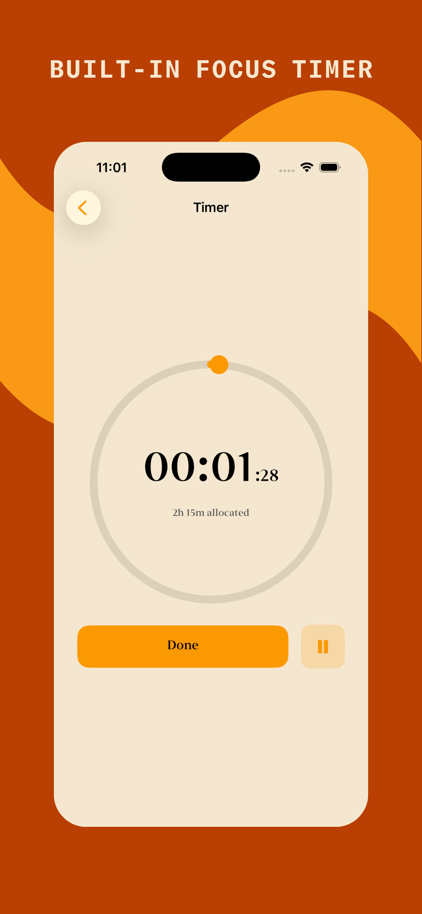

# 🌿 Yansoon (يانسون)

## 📌 Overview

**Yansoon** is an iOS application that optimizes task management by aligning daily workloads with user energy levels, resulting in highly balanced work capacity and sustainable daily productivity.

Unlike traditional to-do lists that focus solely on time and urgency, Yansoon recognizes that human energy is finite. By factoring in your current capacity, it helps prevent burnout and encourages a more mindful approach to daily work.

## ✨ Key Features

*   ⚡ **Energy-Based Planning:** Assign energy requirements to tasks and match them against your daily available capacity.
*   🔋 **Capacity Tracking:** Visual indicators help you see when you are overbooking your energy reserves.
*   ✅ **Seamless Task Management:** Intuitive interface to create, edit, and organize your daily objectives.
*   📊 **Sustainable Productivity:** Designed to keep workloads balanced, helping you achieve more without burning out.

## 📱 Screenshots

  <!-- 📸 PLACE YOUR APP SCREENSHOTS HERE -->
  
  
  
  

